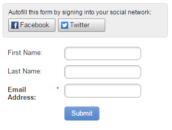

# 在表单上启用社交表单填写功能 {#enable-social-form-fill-on-a-form}

允许您的访客使用其社交网络填写表单。 您会自动获得额外数据，他们会获得更快的体验。

>[!AVAILABILITY]
>
>并非所有客户都购买了此功能。 有关详细信息，请联系您的销售代表。

1. 转到 **营销活动**.

   

1. 选择您的表单并单击 **编辑表单**.

   

1. 在 **表单** **设置** 单击 **设置**.

   

1. 选中要包含的社交网络按钮。

   

   >[!TIP]
   >
   >看看 [数据Marketo将捕获](/help/marketo/product-docs/demand-generation/social/social-functions/manage-social-profile-data.md) 如果人们使用社交按钮。

1. 单击 **完成**.

   

1. 单击 **批准并关闭**.

   

   就在这里。

   

很棒吧？
