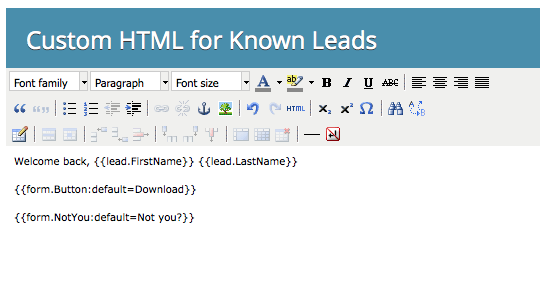

# 显示已知用户的自定义HTML表单{#show-custom-html-form-for-known-people}

如果访客使用cookie（过去提供电子邮件地址的已知人员），那么为什么要费心使用表单？ 只需给他们下载按钮。 这是方法。

1. 转至&#x200B;**Marketing** **活动**。

   

1. 在&#x200B;**Marketing** **活动**&#x200B;下，选择表单并单击&#x200B;**编辑** **表单**。

   

1. 在&#x200B;**Form** **Settings**&#x200B;下，单击&#x200B;**Settings**。

   

1. 如果&#x200B;**Known** **访客，则设置Show**:至&#x200B;**自定义** **HTML**。

   

1. 单击可编辑将向已知用户显示的&#x200B;**Custom** **HTML**。

   

1. 有一些默认内容，但可以随意更改。

   

   可用令牌：

   | 令牌 | 说明 |
   |---|---|
   | `{{lead.FirstName}}` | 将显示该人的名字。 |
   | `{{lead.LastName}}` | 将显示该人的姓。 |
   | `{{form.Button:default=Download}}` | 此时将显示表单按钮。 替换`=`后面的区域以更改按钮文本。 |
   | `{{form.NotYou:default=Not you?}}` | 这将显示一个链接，以防此人是其他人。 替换`=`后面的区域以更改链接文本。 |

   >[!CAUTION]
   >
   >只能使用上述四个令牌。 此处不能使用任何其他令牌。

1. 单击&#x200B;**完成**。

   

1. 单击&#x200B;**批准并关闭**。

   >[!NOTE]
   >
   >必须批准表单才能用于登陆页。

   

   >[!NOTE]
   >
   >**提醒**
   >
   >
   >请记住[批准由表单更改创建的登陆页草稿](../../../../product-docs/demand-generation/landing-pages/understanding-landing-pages/approve-unapprove-or-delete-a-landing-page.md)。

   

   >[!TIP]
   >
   >您可以通过将表单跟进页面设置到文件的URL，将按钮的单击指向资产。

蛋糕！ 查看如果某个人返回同一表单会看到什么：