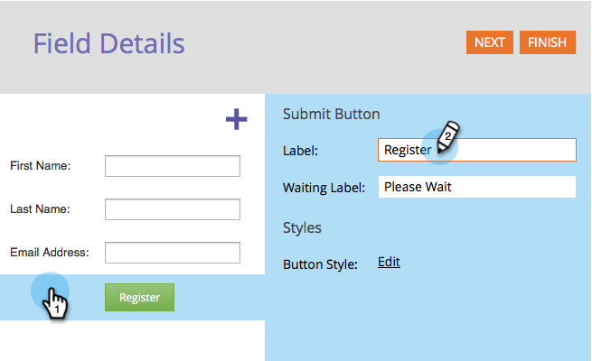

# 更改表单提交按钮文本 {#change-form-submit-button-text}

您可以快速轻松地将表单按钮从“提交”更改为任何其他单词。 这是方法。

1. 转到营 **销****活动**。

   

1. 选择表单，然后单击 **编辑****表单**。

   

1. 选择按钮并更改“标 **签”**。

   

   >[!TIP]
   >
   >注意，您还可以更改等待标签。 单击按钮后和表单提交操作完成之前，将显示该按钮。

1. 单击 **完成**。

   

1. 单击 **批准并关闭**。

   

   砰！

   

