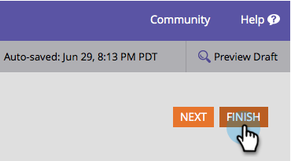

# 更改提交按钮样式和颜色{#change-submit-button-style-and-color}

如果您发现标准提交按钮单调乏味，或者如果您需要更精致的工具，您可以随意选择各种随时可用的按钮样式。

1. 转到&#x200B;**营销活动**。

   

1. 选择表单，然后单击&#x200B;**编辑表单**。

   

1. 选择&#x200B;**Submit**&#x200B;按钮，然后单击“按钮样式”旁的&#x200B;**Edit**。

   

   >[!TIP]
   >
   >您知道可以将提交按钮向左或向右拖动以更改其位置吗？ 就这么简单。 试试看！

1. 选择您喜欢的按钮样式（向上／向下滚动）。

   

1. 您可以保留颜色为默认颜色，也可以自定义颜色。

   

   >[!TIP]
   >
   >您还可以手动输入颜色代码。

1. 单击&#x200B;**选择**。

   

1. 单击&#x200B;**完成**。

   

1. 单击&#x200B;**批准并关闭**。

   

   给你！

   

   >[!NOTE]
   >
   >与许多图形元素一样，按钮的外观可能会因您所使用的浏览器而有所不同。
