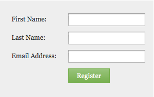

# 更改表单字体系列 {#change-the-form-font-family}

Google字体非常棒，我们将它们直接构建到表单编辑器中。 看看！

>[!NOTE]
>
>此设置会影响表单标签、输入文本和任何富文本。

1. 转到 **营销活动**.

   

1. 选择您的表单并单击 **编辑表单**.

   

1. 在 **表单设置**，选择 **设置**.

   

1. 选择 **字体系列** 你想。

   >[!TIP]
   >
   >一群 [Google Fonts](https://www.google.com/fonts) 可供使用。

   

1. 单击 **完成**.

   

1. 单击 **批准并关闭**.

   >[!NOTE]
   >
   >表单必须获得批准才能在登陆页面上使用。

   

   >[!NOTE]
   >
   >请记住批准由表单更改创建的登陆页面草稿。

   

看看在表单上更改字体系列有多容易？ 很好，现在已经完成了，让我们学习如何更改表单字体大小。

>[!MORELIKETHIS]
>
>[更改表单字体大小](/help/marketo/product-docs/demand-generation/forms/form-design/change-the-form-font-size.md)
