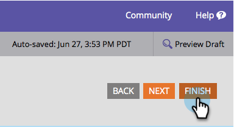

# 更改表单字体系列 {#change-the-form-font-family}

Google Fonts非常棒，我们将它们直接构建到表单编辑器中。 看看！

>[!NOTE]
>
>此设置影响表单标签、输入文本和任何富文本。

1. 转到营 **销****活动**。

   

1. 选择表单，然后单击 **编辑****表单**。

   

1. 在“表 **单设****置**”下 **，选**&#x200B;择“设置”。

   

1. 选择 **所需的字** 体系列。

   >[!TIP]
   >
   >大量Google [字体可](http://www.google.com/fonts) 供使用。

   

1. 单击 **完成**。

   

1. 单击 **批准并关闭**。

   >[!NOTE]
   >
   >必须批准表单才能用于登陆页。

   

   >[!NOTE]
   >
   >**提醒**
   >
   >
   >请记住批准由表单更改创建的登陆页草稿。

   

了解在表单上更改字体系列有多轻松？ 好，现在已完成，让我们学习如何更改表单字体大小。

>[!NOTE]
>
>**相关文章**
>
>* [更改表单字体大小](change-the-form-font-size.md)

>

