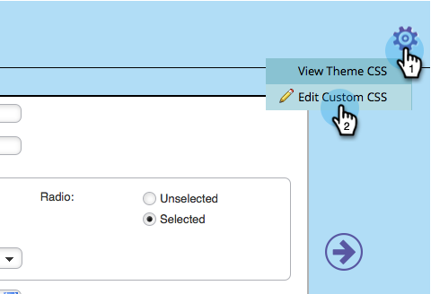

# 编辑表单主题的CSS {#edit-the-css-of-a-form-theme}

您有几个预建的 [您可从中选择的主题](/help/marketo/product-docs/demand-generation/forms/creating-a-form/select-a-form-theme.md). 但是，如果您喜欢编辑CSS，则可以进行任何所需的更改。 具体方法如下。

>[!NOTE]
>
>如果您希望尝试此操作，请确保您知道CSS，因为Marketo支持未设置为协助自定义编码。 此外，所做的任何更改将仅应用于您当前编辑的表单。

1. 转到 **营销活动**.

   

1. 选择您的表单并单击 **编辑表单**.

   

1. 转到 **表单设置**.

   

1. 选择要更改的主题。

   

1. 在齿轮图标下，单击 **查看主题CSS**.

   

1. 欢迎您随时将此CSS剪切/粘贴到您自己的编辑器中。 它是只读的，因此您只需要覆盖CSS。

   

1. 单击&#x200B;**关闭**。

   

1. 在齿轮图标下，单击 **编辑自定义CSS**.

   

1. 输入您的自定义CSS。 你不需要所有的东西，只需要那些不同的部分。

   

1. 完成后，单击 **保存**.

   

1. 要查看自定义表单，请单击 **预览草稿**.

   

就是这样！
