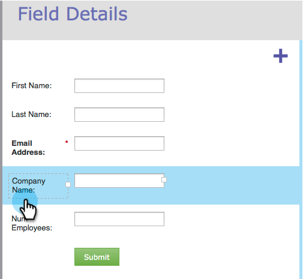

# 在表单中调整标签/字段宽度 {#resize-label-field-width-in-a-form}

可通过两种方式调整字段标签宽度和字段宽度本身的大小。

## 拖放宽度 {#drag-and-drop-the-width}

1. 在 [表单编辑器](/help/marketo/product-docs/demand-generation/forms/form-actions/edit-a-form.md)，选择要调整大小的字段。

   

1. 拖动标签角或字段角可调整大小。

   

## 手动输入宽度 {#enter-the-width-manually}

1. 选择要调整大小的字段。

   

1. 为“标签宽度”和/或“字段宽度”输入像素值。

   

干得好！ 很简单，对吧？
