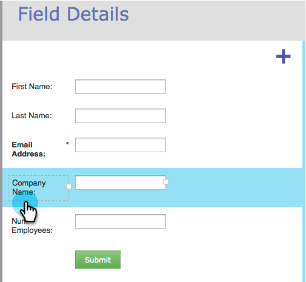

# 调整表单中的标签/字段宽度 {#resize-label-field-width-in-a-form}

有两种方法既可以调整字段标签宽度，也可以调整字段宽度本身。

## 拖放宽度 {#drag-and-drop-the-width}

1. 在[表单编辑器](/help/marketo/product-docs/demand-generation/forms/form-actions/edit-a-form.md)中，选择要调整大小的字段。

   

1. 拖动标签角或字段角以调整大小。

   

## 手动输入宽度 {#enter-the-width-manually}

1. 选择要调整大小的字段。

   

1. 为[!UICONTROL Label Width]和/或[!UICONTROL Field Width]输入像素值。

   

