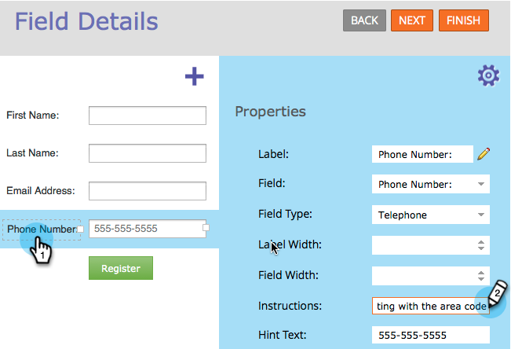

# 向表单字段添加工具提示说明 {#add-tooltip-instructions-to-a-form-field}

[提示](/help/marketo/product-docs/demand-generation/forms/form-fields/add-hint-text-to-a-form-field.md)和说明可帮助人们填写表单。 以下是如何添加工具提示说明。

>[!NOTE]
>
>**定义**
>
>表单&#x200B;**提示**&#x200B;是当访客开始在字段中键入内容时字段中消失的文本。
>
>表单&#x200B;**说明**&#x200B;是当访客将鼠标悬停在该字段上时弹出的小工具提示。

1. 前往 **[!UICONTROL Marketing Activities]**。

   

1. 选择您的&#x200B;**表单**&#x200B;并单击&#x200B;**[!UICONTROL Edit Form]**。

   

1. 选择您的字段并输入&#x200B;**[!UICONTROL Instructions]**。

   

1. 单击 **[!UICONTROL Finish]**。

   

1. 单击 **[!UICONTROL Approve and Close]**。

   

   >[!NOTE]
   >
   >请记住[批准由表单更改创建的登陆页面草稿](/help/marketo/product-docs/demand-generation/landing-pages/understanding-landing-pages/approve-unapprove-or-delete-a-landing-page.md)。

   

当访客将鼠标悬停在该字段上时，将显示工具提示。
