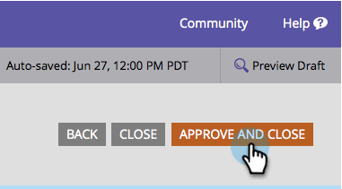

# 删除表单中的字段 {#delete-a-field-in-a-form}

如果表单上存在您不再需要的字段，则可以轻松删除该字段。 具体方法如下。

1. 转到&#x200B;**[!UICONTROL Marketing Activities]**。

   

1. 选择表单并单击&#x200B;**[!UICONTROL Edit Form]**。

   

1. 选择您的字段并单击&#x200B;**[!UICONTROL Delete]**&#x200B;图标。

   

1. 单击 **[!UICONTROL Finish]**。

   

1. 单击 **[!UICONTROL Approve and Close]**。

   

>[!NOTE]
>
>不要忘记[批准由表单更改创建的登陆页面草稿](/help/marketo/product-docs/demand-generation/landing-pages/understanding-landing-pages/approve-unapprove-or-delete-a-landing-page.md)。
