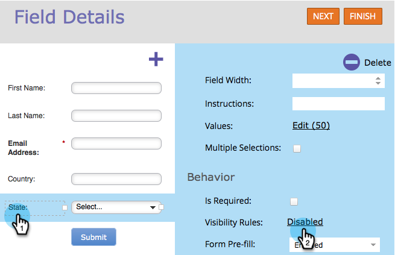

# 动态切换表单字段的可见性 {#dynamically-toggle-visibility-of-a-form-field}

>[!PREREQUISITES]
>
>* [向表单中添加国家/地区选择列表](/help/marketo/product-docs/demand-generation/forms/form-actions/add-a-country-picklist-to-your-form.md)

Marketo表单的一个真正酷的功能是，您可以动态隐藏/显示表单字段或[字段集](/help/marketo/product-docs/demand-generation/forms/form-fields/add-a-fieldset-to-a-form.md)。

>[!NOTE]
>
>**示例**
>
>在本例中，除非选择&#x200B;**国家/地区**&#x200B;作为“美国”，否则我们将隐藏&#x200B;**国家/地区**&#x200B;字段。

1. 转到&#x200B;**[!UICONTROL Marketing Activities]**。

   

1. 选择您的表单并单击&#x200B;**[!UICONTROL Edit Form]**。

   

1. 选择要动态隐藏/显示的字段，然后单击&#x200B;**[!UICONTROL Visibility Rules]**&#x200B;的链接。

   

1. 查找并选择要在其周围构建条件的字段。

   

1. 选择运算符。

   >[!TIP]
   >
   >这很酷，因为您可以选择模糊匹配，如&quot;[!UICONTROL starts with]&quot;。

   

1. 选择要查找的值，然后单击下拉列表外部的。

   

   >[!TIP]
   >
   >您可以在下拉列表打开时单击多个值来选择它们。 例如，您可以选择“美国”和“加拿大”。

   >[!NOTE]
   >
   >我们以前将“国家/地区”转换为选择列表字段类型，并且[已将所有国家/地区添加为值](/help/marketo/product-docs/demand-generation/forms/form-actions/add-a-country-picklist-to-your-form.md)。

1. 单击 **[!UICONTROL Save]**。

   

就是这样！ 现在，当人们填写此表单并选择“美国国家/地区”时，“州”字段将动态显示指定的选项。

>[!IMPORTANT]
>
>使用Forms 2.0中的[API函数](https://experienceleague.adobe.com/en/docs/marketo-developer/marketo/javascriptapi/forms-api-reference){target="_blank"}通过自定义脚本设置/更新字段值时，表单字段行为将无缝工作。
>
>如果字段值由Forms 2.0 JavaScript API以外的外部脚本修改，则条件字段可能无法按预期工作。
