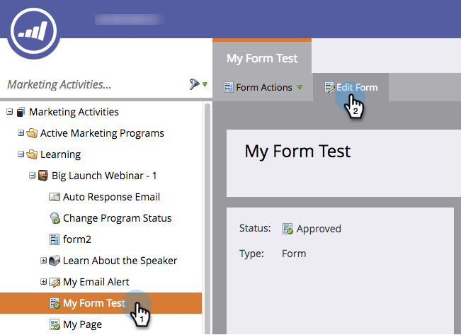

# 动态切换表单字段的可见性 {#dynamically-toggle-visibility-of-a-form-field}

>[!PREREQUISITES]
>
>* [将国家/地区选取列表添加到表单](/help/marketo/product-docs/demand-generation/forms/form-actions/add-a-country-picklist-to-your-form.md)

Marketo表单的一个非常酷的功能是，您可以动态隐藏/显示表单字段或 [字段集](/help/marketo/product-docs/demand-generation/forms/form-fields/add-a-fieldset-to-a-form.md).

>[!NOTE]
>
>**示例**
>
>在本例中，我们将隐藏 **州** 除外 **国家/地区** 被选为“美国”。

1. 转到 **营销活动**.

   

1. 选择您的表单并单击 **编辑表单**.

   

1. 选择要动态隐藏/显示的字段，然后单击 **可见性规则**.

   

1. 查找并选择要围绕此字段构建条件。

   

1. 选择运算符。

   >[!TIP]
   >
   >这很酷，因为您可以选择模糊匹配，如“开头为”。

   

1. 选择要查找的值，然后单击下拉列表外的。

   

   >[!TIP]
   >
   >在下拉列表打开时，您可以单击以选择多个值。 例如，您可以选择美国和加拿大。

   >[!NOTE]
   >
   >我们以前将“国家/地区”转换为挑库列表字段类型， [将所有国家/地区作为值添加](/help/marketo/product-docs/demand-generation/forms/form-actions/add-a-country-picklist-to-your-form.md).

1. 单击 **保存**.

   

就这样！ 现在，当用户填写此表并选择“美国为国家”时，“状态”字段将动态显示并提供指定的选项。
