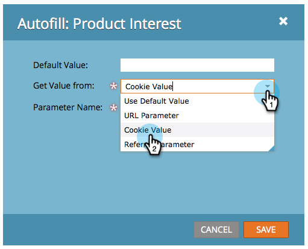

# 设置隐藏的表单字段值 {#set-a-hidden-form-field-value}

隐藏字段通常是动态填充的。 不会向填写表单的人显示这些表格。 以下是如何设置值。

>[!PREREQUISITES]
>
>[将表单字段设置为隐藏](/help/marketo/product-docs/demand-generation/forms/form-fields/set-a-form-field-as-hidden.md)

## 选择字段 {#select-the-field}

1. 在您的表单中，选择隐藏字段并单击 **编辑** 表示 **自动填充**.

   

## 使用默认值 {#use-default-value}

通过选择使用默认值，您可以对提交此表单时始终使用的特定值进行硬编码。 输入默认值，然后单击保存。

## URL参数 {#url-parameter}

如果要在填写表单时从人员所在的页面中捕获URL参数（查询字符串），您可以使用 **URL参数** 来填充隐藏字段。

>[!NOTE]
>
>参数有点技术，不是吗？ 但一旦你得到它们，它们就会强大。 此 [查询字符串上的维基百科页面](https://en.wikipedia.org/wiki/Query_string) 有帮助。

1. 选择 **URL参数** 表示 **获取值类型**.

   

1. 输入 **参数名称** 单击 **保存**.

   

>[!TIP]
>
>如果找不到URL参数，您可以输入默认值。

## Cookie值 {#cookie-value}

如果您在Cookie中存储数据，则可以使用 **Cookie值** 以在提交表单时提取数据。

1. 选择 **Cookie值** 表示 **从获取值**.

   

1. 输入所需的Cookie参数名称，然后单击 **保存**.

   

   >[!TIP]
   >
   >如果找不到参数/Cookie，您可以输入默认值。

## 反向链接参数 {#referrer-parameter}

如果要在填写表单之前从访客来自的页面中捕获数据，可以使用 **反向链接参数**.

1. 已设置 **从获取值** to **反向链接参数**.

   

1. 输入 **参数名称** 要从反向链接URL中提取的内容，然后单击 **保存**.

   

   >[!TIP]
   >
   >您可以输入 **默认值** （以防未找到referrer参数）。

1. 单击 **完成**.

   

1. 单击 **批准并关闭**.

   
