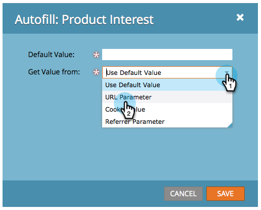

# 设置隐藏表单字段值{#set-a-hidden-form-field-value}

隐藏字段通常动态填充。 不会向填写表单的人显示。 下面介绍如何设置值。

>[!PREREQUISITES]
>
>[将表单字段设置为隐藏](/help/marketo/product-docs/demand-generation/forms/form-fields/set-a-form-field-as-hidden.md)

## 选择字段{#select-the-field}

1. 在表单中，选择隐藏字段，然后单击&#x200B;**编辑**（对于&#x200B;**自动填写**）。

   

## 使用默认值{#use-default-value}

通过选择使用默认值，您可以硬编码在提交此表单时始终使用的特定值。 输入默认值，然后单击保存。

## URL参数{#url-parameter}

如果要在填写表单时从人员所在的页面捕获URL参数(查询字符串)，可使用&#x200B;**URL参数**&#x200B;填充隐藏字段。

>[!NOTE]
>
>参数有点技术，不是吗？ 但一旦你得到了它们，它们就会变得强大。 查询字符串](https://en.wikipedia.org/wiki/Query_string)上的[Wikipedia页面有些帮助。

1. 为&#x200B;**获取值类型**&#x200B;选择&#x200B;**URL参数**。

   

1. 输入&#x200B;**参数名称**&#x200B;并单击&#x200B;**保存**。

   

>[!TIP]
>
>如果找不到URL参数，可以输入默认值。

## Cookie值{#cookie-value}

如果您正在Cookie中存储数据，则可以在提交表单时使用&#x200B;**Cookie值**&#x200B;来获取数据。

1. 为&#x200B;**从**&#x200B;获取值选择&#x200B;**Cookie值**。

   

1. 输入所需的Cookie参数名称，然后单击&#x200B;**保存**。

   

   >[!TIP]
   >
   >如果找不到参数/cookie，可以输入默认值。

## 推荐人参数{#referrer-parameter}

如果要在填写表单之前从访客来自的页面捕获数据，可以使用&#x200B;**推荐人参数**。

1. 将&#x200B;**获取值从**&#x200B;设置为&#x200B;**推荐人参数**。

   

1. 输入要从推荐人URL抢取的&#x200B;**参数名称**，然后单击&#x200B;**保存**。

   

   >[!TIP]
   >
   >如果找不到推荐人参数，可输入&#x200B;**默认值**。

1. 单击&#x200B;**完成**。

   

1. 单击&#x200B;**批准并关闭**。

   
