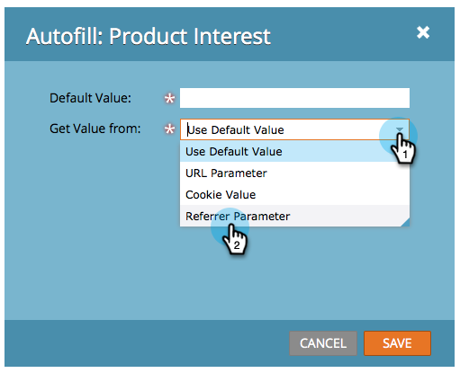

# 设置隐藏表单字段值 {#set-a-hidden-form-field-value}

隐藏字段通常会动态填充。 它们不会显示给填写表单的人。 下面是如何设置该值的。

>[!PREREQUISITES]
>
>[将表单字段设置为隐藏](/help/marketo/product-docs/demand-generation/forms/form-fields/set-a-form-field-as-hidden.md)

## 选择字段 {#select-the-field}

1. 在您的表单中，选择隐藏字段并单击&#x200B;**[!UICONTROL Edit]**&#x200B;的&#x200B;**[!UICONTROL Autofill]**。

   

## 使用默认值 {#use-default-value}

通过选择“使用&#x200B;**[!UICONTROL Default Value]**”，您可以对特定值进行硬编码，以便在提交此表单时始终使用。 输入&#x200B;**[!UICONTROL Default Value]**&#x200B;并单击&#x200B;**[!UICONTROL Save]**。

## URL 参数 {#url-parameter}

如果要从人员填写表单时所在的页面中捕获URL参数（查询字符串），则可以使用&#x200B;**[!UICONTROL URL Parameters]**&#x200B;填充隐藏字段。

>[!NOTE]
>
>这些参数有点技术性，不是吗？ 一旦你得到它们，它们就会变得强大。 查询字符串[上的此](https://en.wikipedia.org/wiki/Query_string)Wikipedia页面有些帮助。

1. 为&#x200B;**[!UICONTROL URL Parameter]**&#x200B;选择&#x200B;**[!UICONTROL Get Value Type]**。

   

1. 输入&#x200B;**[!UICONTROL Parameter Name]**&#x200B;并单击&#x200B;**[!UICONTROL Save]**。

   

>[!TIP]
>
>如果找不到URL参数，则可以输入&#x200B;**[!UICONTROL Default Value]**。

## Cookie值 {#cookie-value}

如果您将数据存储在Cookie中，则可以使用&#x200B;**[!UICONTROL Cookie Value]**&#x200B;在提交表单时提取数据。

1. 为&#x200B;**[!UICONTROL Cookie Value]**&#x200B;选择&#x200B;**[!UICONTROL Get Value From]**。

   

1. 输入所需的Cookie **[!UICONTROL Parameter Name]**，然后单击&#x200B;**[!UICONTROL Save]**。

   

   >[!TIP]
   >
   >如果找不到参数/Cookie，则可以输入&#x200B;**[!UICONTROL Default Value]**。

## 反向链接参数 {#referrer-parameter}

如果您要在填写表单之前从访客来自的页面捕获数据，则可以使用&#x200B;**[!UICONTROL Referrer Parameter]**。

1. 将&#x200B;**[!UICONTROL Get Value From]**&#x200B;设置为&#x200B;**[!UICONTROL Referrer Parameter]**。

   

1. 输入要从反向链接URL中抓取的&#x200B;**[!UICONTROL Parameter Name]**，然后单击&#x200B;**[!UICONTROL Save]**。

   

   >[!TIP]
   >
   >如果找不到反向链接参数，则可以输入&#x200B;**[!UICONTROL Default Value]**。

1. 单击 **[!UICONTROL Finish]**。

   

1. 单击 **[!UICONTROL Approve and Close]**。

   
