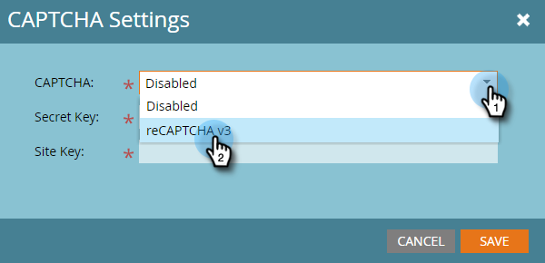
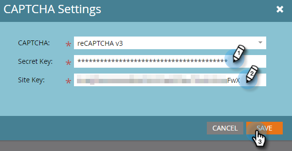

# 设置reCAPTCHA v3 {#setting-up-recaptcha-v3}

ReCAPTCHA v3是一款流畅的体验，它根据表单提交的可疑程度为其打分，而不使用文本、图像或按钮挑战。 [了解详情](https://developers.google.com/search/blog/2018/10/introducing-recaptcha-v3-new-way-to){target="_blank"}.

## 检索数据中心和Munchkin ID {#retrieve-your-data-center-and-munchkin-id}

对于下面的初始reCAPTCHA v3设置部分中的步骤6，您将需要Marketo Engage订阅的数据中心和Munchkin ID。 下面是如何找到他们的。

1. 在Marketo中，单击 **管理员**.

   

1. 单击 **我的帐户**.

   

1. 向下滚动至“Support Information（支持信息）”。

   

## 初始reCAPTCHA v3设置 {#initial-recaptcha-v3-setup}

在Marketo之外执行以下步骤。

1. 转到 [https://www.google.com/recaptcha/about/](https://www.google.com/recaptcha/about/){target="_blank"} 并单击v3Admin Console。

1. 使用Google帐户登录/注册。

1. 单击“创建”按钮（+号）以创建新密钥。

1. 创建标签以标识用于Marketo Engage的键。

1. 选择类型 **reCAPTCHA v3**. Marketo Engage当前不支持reCAPTCHA v2。

1. 添加Marketo Engage订阅使用的每个域。 此处未设置的域将在启用reCAPTCHA的表单中返回错误。 请记得将“datacenter”和“munchkinID”替换为 [订阅中的数据](#retrieve-your-data-center-and-munchkin-id).

   * app-datacenter.marketo.com
   * munchkinID.mktoweb.com
   * 订阅中配置的任何登陆页面域和别名

   >[!NOTE]
   >
   >例如，如果客户的数据中心为“sjst”，则允许列表的域将为 `app-sjst.marketo.com`. 如果Munchkin ID为123-ABC-789，则允许列表的域将为 `123-ABC-789.mktoweb.com`.

1. 设置所有者和应接收有关此服务的所有警报的其他电子邮件地址。

1. 接受reCAPTCHA服务条款。

1. 单击 **提交**.

   >[!NOTE]
   >
   >为Marketo Engage配置随时准备站点密钥和密钥。

## 在Marketo Engage中设置验证码 {#setting-up-captcha-in-marketo-engage}

>[!IMPORTANT]
>
>执行以下步骤和 [在第一个Marketo表单中启用验证码](/help/marketo/product-docs/demand-generation/forms/using-captcha/enable-captcha-in-marketo-forms.md){target="_blank"}，请务必立即测试表单，因为reCAPTCHA设置中的任何错误配置都可能会破坏表单。

1. 在Marketo中，单击 **管理员**.

   

1. 选择 **验证码** 在树上。

   

1. 单击 **编辑** 在验证码设置上。

   

1. 单击CAPTCHA下拉列表，然后选择reCAPTCHA v3。

   

1. 插入密钥和站点密钥。 单击 **保存** 完成时。

   

>[!MORELIKETHIS]
>
>[在Marketo Forms中启用验证码](/help/marketo/product-docs/demand-generation/forms/using-captcha/enable-captcha-in-marketo-forms.md)
