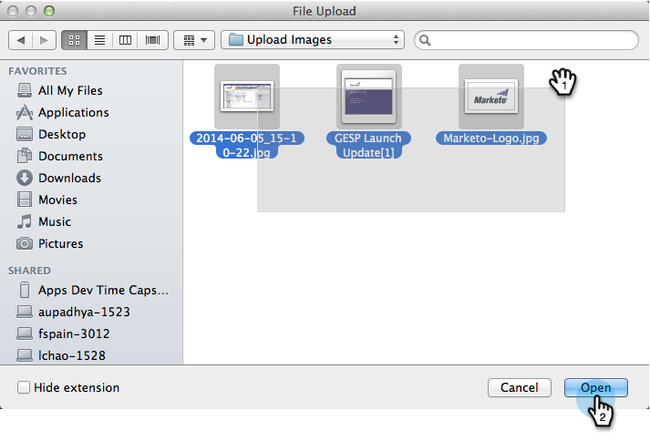

# 将图像和文件添加到Marketo {#add-images-and-files-to-marketo}

可以轻松地同时添加多个图像和文件。

1. 转到 **Design Studio**.

   

1. 下 **新**，单击 **上传图像** 或 **文件**.

   

1. 选择要存储图像或文件的文件夹，然后单击 **浏览**.

   

   >[!NOTE]
   >
   >每个文件的最大大小为100MB。

1. 要添加多个图像和文件，请浏览到计算机上的正确文件夹，然后按 **Ctrl/Cmd** ，单击要添加的每个文件，然后单击 **打开**.

   

1. 展开 **文件详细信息** 验证您选择了正确的图像，然后单击 **上传**.

   

   >[!NOTE]
   >
   >要在上载之前删除任何排队的文件，请单击文件名旁边的x。

   >[!TIP]
   >
   >Marketo将在上传之前扫描所有文件；将跳过感染病毒的文件。

1. 上传完成后，单击 **完成**.

   

1. 您的图像现在可用于营销活动电子邮件和登陆页面。

   

做得好！

>[!NOTE]
>
>虽然Marketo接受上传的所有文件类型，但只有主要图像类型(JPG、PNG、GIF等) 将在我们的电子邮件编辑器中工作。

>[!MORELIKETHIS]
>
>[使用文件夹组织图像和文件](/help/marketo/product-docs/demand-generation/images-and-files/organize-your-images-and-files-using-folders.md)
