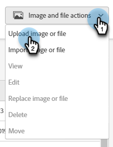
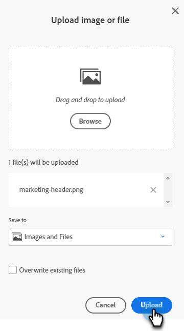

# 向 Marketo 添加图像和文件 {#add-images-and-files-to-marketo}

了解如何向Marketo Engage实例添加新图像或文件。

1. 转到&#x200B;**[!UICONTROL Design Studio]**。

   

1. 选择&#x200B;**[!UICONTROL Images and Files]**

   

1. 点击 **[!UICONTROL Image and file actions]** 下拉菜单，并选择 **[!UICONTROL Upload image or file]**。

   

1. 拖放所需的图像/文件，或浏览计算机找到它。

   

   >[!NOTE]
   >
   >每个文件的最大大小为100MB。

1. 选择资产后，单击&#x200B;**上传**。

   

   >[!NOTE]
   >
   >虽然Marketo接受上传的所有文件类型，但只有主要的图像类型（JPG、PNG、GIF等） 将在电子邮件编辑器中工作。

   >[!MORELIKETHIS]
   >
   >[使用文件夹组织您的图像和文件](/help/marketo/product-docs/demand-generation/images-and-files/organize-your-images-and-files-using-folders.md){target="_blank"}
