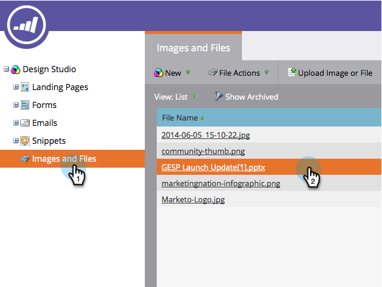

# 删除上传的图像或文件 {#delete-an-uploaded-image-or-file}

1. 转到 **设计** **Studio**.

   

1. 选择 **图像和文件** 在左侧菜单中，单击要删除的文件名称旁边的。

   

1. 单击 **文件操作** 下拉框并选择 **删除**.

   

1. 确认您选择了正确的文件，然后单击 **删除**.

   

   >[!CAUTION]
   >
   >已删除的图像和文件将从Marketo中完全删除，无法恢复。  它们将不再显示在使用中的任何登陆页面或电子邮件中。

1. 您将返回到 **图像** 和 **文件** 页面，您将看到文件已被删除。

   

干得好！

>[!MORELIKETHIS]
>
>* [替换上传的图像或文件](/help/marketo/product-docs/demand-generation/images-and-files/replace-an-uploaded-image-or-file.md)
>* [搜索上传的图像和文件](/help/marketo/product-docs/demand-generation/images-and-files/search-uploaded-images-and-files.md)
>* [查找上传的图像或文件的URL](/help/marketo/product-docs/demand-generation/images-and-files/find-the-url-of-an-uploaded-image-or-file.md)

