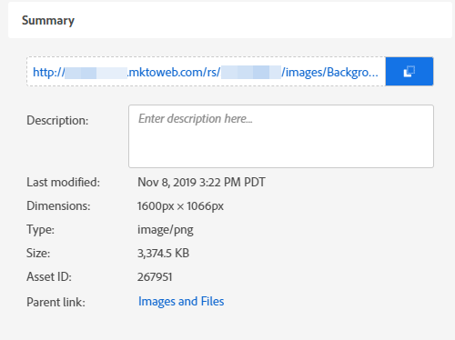

# 查找已上传图像或文件的 URL {#find-the-url-of-an-uploaded-image-or-file}

正在查找您上传的图像或文件的网址(URL)？

1. 转到&#x200B;**[!UICONTROL Design Studio]**。

   

1. 单击 **[!UICONTROL Images and Files]**。

   

1. 选择所需的资源。

   

1. **[!UICONTROL URL]**&#x200B;显示在详细信息页面上。

   

>[!MORELIKETHIS]
>
>[替换上载的图像或文件](/help/marketo/product-docs/demand-generation/images-and-files/replace-an-uploaded-image-or-file.md){target="_blank"}
