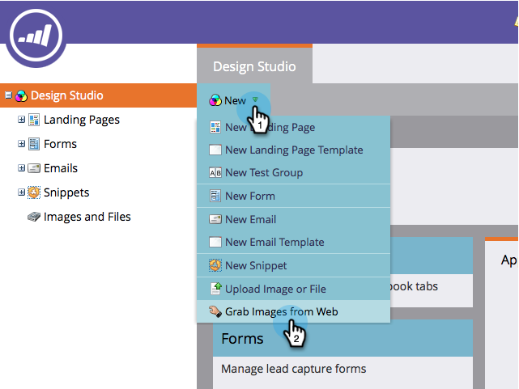

# 从网页中获取图像 {#grab-the-images-from-a-web-page}

要从网页添加图像，请复制包含所需图像的页面的网址(URL)，然后执行这些简单步骤。

1. 转到 **Design Studio**.

   

1. 单击 **新建** 和 **从Web中获取图像**.

   

1. 选择 **图像和文件** ，请将网址(URL)粘贴到URL文本框中，然后单击 **下一个**.

   

   >[!NOTE]
   >
   >此功能不适用于直接指向图像的URL。 使用包含图像的网页的URL。

1. 选择要添加的图像，然后单击 **导入**.

   

1. 您的图像现已导入，可在电子邮件和登陆页面中使用。

   

1. 您可以在 **图像和文件**.

   

干得好，形象主控!

>[!MORELIKETHIS]
>
>* [将图像和文件添加到Marketo](/help/marketo/product-docs/demand-generation/images-and-files/add-images-and-files-to-marketo.md)
>* [使用文件夹整理图像和文件](/help/marketo/product-docs/demand-generation/images-and-files/organize-your-images-and-files-using-folders.md)
>* [查找上传的图像或文件的URL](/help/marketo/product-docs/demand-generation/images-and-files/find-the-url-of-an-uploaded-image-or-file.md)
>* [从框中上传图像和文件](/help/marketo/product-docs/demand-generation/images-and-files/upload-images-and-files-from-box.md)

