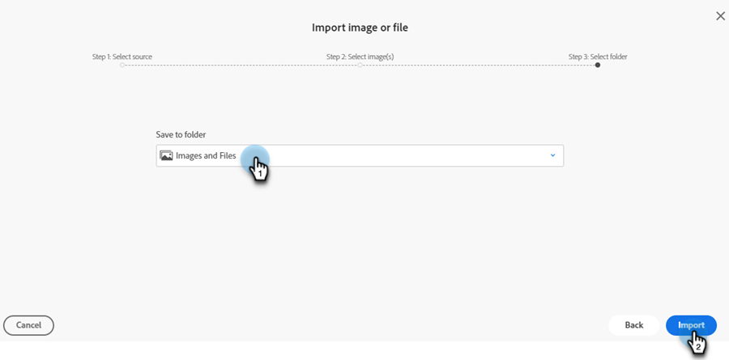

# 新建添加图像文档 {#new-add-images-doc}

您有多个选项可以将新文件/图像添加到您的“图像和文件”存储库。

## 上传图像或文件 {#upload-image-or-file}

1. 转到 **Design Studio**.

   

1. 选择 **[!UICONTROL 图像和文件]**

   

1. 单击 **[!UICONTROL 图像和文件操作]** 下拉并选择 **[!UICONTROL 上传图像或文件]**.

   

1. 拖放所需的图像/文件，或浏览计算机找到它。

   

1. 选择资源后，单击 **上传**.

   

## 导入图像或文件 {#import-image-or-file}

有三种方法可用于导入图像。 我们逐一回顾一下。

### 从Web导入 {#import-from-the-web}

文本

1. 执行步骤1和2 [自上面](#upload-image-or-file).

1. 单击 **[!UICONTROL 图像和文件操作]** 下拉并选择 **[!UICONTROL 导入图像或文件]**.

   

1. 选择 **[!UICONTROL Web]** 选项并单击 **[!UICONTROL 下一个]**.

   

1. 在URL中键入或粘贴到所需图像并单击 **下一个**.

PICC

1. 单击“空白”。

PICC

### 从框导入 {#import-from-box}

文本

1. 执行步骤1和2 [自上面](#upload-image-or-file).

1. 单击 **[!UICONTROL 图像和文件操作]** 下拉并选择 **[!UICONTROL 导入图像或文件]**.

   

1. 选择 **[!UICONTROL 盒子]** 选项并单击 **[!UICONTROL 下一个]**.

   

   >[!NOTE]
   >
   >如果您之前未这样做，则将要求您登录您的Box帐户以授予访问权限。

1. 选择所需的Box文件夹并单击 **[!UICONTROL 下一个]**.

   

1. 选择所需的图像并单击 **[!UICONTROL 下一个]**.

   

1. 选择要将图像保存到的Marketo Engage文件夹。 在本例中，我们将保留为“Images and Files（图像和文件）”（默认）。 单击 **导入**.

   

### 从Adobe Experience Manager导入 {#import-from-adobe-experience-manager}

文本

1. 执行步骤1和2 [自上面](#upload-image-or-file).

1. 单击 **[!UICONTROL 图像和文件操作]** 下拉并选择 **[!UICONTROL 导入图像或文件]**.

   

1. 选择 **[!UICONTROL Adobe Experience Manager]** 选项并单击 **[!UICONTROL 下一个]**.

   

   >[!NOTE]
   >
   >如果您之前未这样做，则将要求您登录到您的AEM帐户。

1. 文本

PICC

1. 文本

PICC

1. 文本
