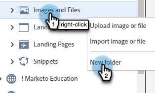

# 使用文件夹组织您的图像和文件 {#organize-your-images-and-files-using-folders}

通过创建文件夹，您可以移动图像和文件、查看所需的图像集，以及直接上传到特定文件夹。

1. 转到&#x200B;**[!UICONTROL Design Studio]**。

   

1. 右键单击&#x200B;**[!UICONTROL Images and Files]**&#x200B;并选择&#x200B;**[!UICONTROL New folder]**。

   

1. 命名您的文件夹并单击&#x200B;**[!UICONTROL Create]**。

   

1. 返回&#x200B;**[!UICONTROL Images and Files]**&#x200B;并选择要移动的资产。 点击 **[!UICONTROL Image and file actions]** 下拉菜单，并选择 **[!UICONTROL Move]**。

   

1. 选择所需的文件夹。

   

1. 单击&#x200B;**移动移动**。

   

>[!MORELIKETHIS]
>
>[搜索上载的图像和文件](/help/marketo/product-docs/demand-generation/images-and-files/search-uploaded-images-and-files.md){target="_blank"}
