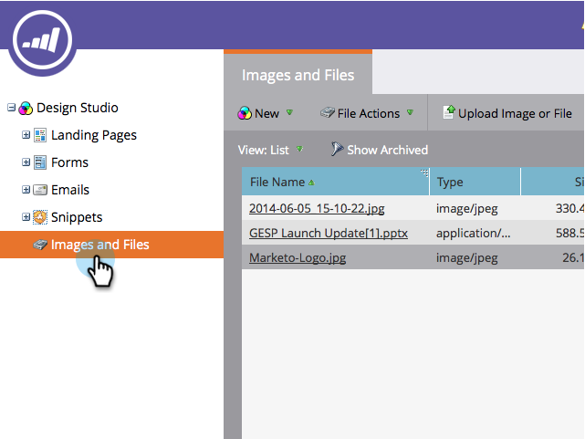

# 搜索上传的图像和文件 {#search-uploaded-images-and-files}

在Marketo中，轻松查找图像和文件。

1. 转到 **Design Studio**.

   

1. 单击 **图像和文件** 查看所有已上传文件的完整列表。

   

1. 在 **快速查找** 框中，键入要查找的文件的名称，然后单击 **输入**.

   

>[!TIP]
>
>要开始新搜索，请单击 **x** 在 **快速查找** 盒子。

把脚踢起来，你做完了！

>[!MORELIKETHIS]
>
>* [替换上传的图像或文件](/help/marketo/product-docs/demand-generation/images-and-files/replace-an-uploaded-image-or-file.md)
>* [使用文件夹组织图像和文件](/help/marketo/product-docs/demand-generation/images-and-files/organize-your-images-and-files-using-folders.md)
