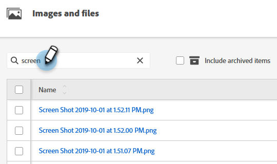

# 搜索已上传的图像和文件 {#search-uploaded-images-and-files}

了解如何搜索图像或文件。

1. 转到&#x200B;**[!UICONTROL Design Studio]**。

   

1. 单击&#x200B;**[!UICONTROL Images and Files]**&#x200B;可获取所有已上载文件的完整列表。

   

1. 在“搜索”框中，键入文件以开头的词并按&#x200B;**Enter**。

   

>[!NOTE]
>
>此时，图像和文件搜索仅利用“开头为”功能。

>[!MORELIKETHIS]
>
>* [替换上载的图像或文件](/help/marketo/product-docs/demand-generation/images-and-files/replace-an-uploaded-image-or-file.md){target="_blank"}
>* [使用文件夹组织您的图像和文件](/help/marketo/product-docs/demand-generation/images-and-files/organize-your-images-and-files-using-folders.md){target="_blank"}
