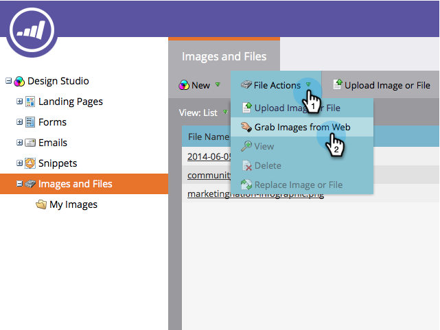

# 从框上载图像和文件 {#upload-images-and-files-from-box}

您可以从Box上传文件以在登陆页面和电子邮件上使用。

1. 转到 **Design Studio**.

   

1. 转到 **图像和文件**. 单击 **文件操作** 并选择 **从Web获取图像**.

   

1. 单击 **Box**.

   

1. 输入您的Box登录名。

   

1. 允许Marketo访问您的Box帐户。

   

1. 选择要保存文件的位置。 然后选择 **Box** 要从中上传的文件夹。 单击 **下一个**.

   

1. 选择要上载的文件。 单击 **导入**.

   

您的文件现已准备就绪，可用于登陆页面和电子邮件！
