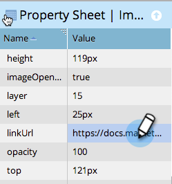

# 在自由格式登陆页面中添加指向图像的链接 {#add-a-link-to-an-image-in-a-free-form-landing-page}

希望将登陆页面上的图像作为指向其他页面/网站的链接吗？ 下面是具体操作方法。

>[!PREREQUISITES]
>
>[将图像添加到自由表单登陆页面](/help/marketo/product-docs/demand-generation/landing-pages/free-form-landing-pages/add-an-image-to-a-free-form-landing-page.md)

1. 单击要向其添加链接的图像。

   

1. 展开 **属性表**.

   

1. 将链接复制或键入到 **linkUrl** 盒子。

   

   恭喜！您现在已成功添加指向登陆页面上图像的链接。 您现在可以 [预览页面](/help/marketo/product-docs/demand-generation/landing-pages/landing-page-actions/preview-a-landing-page.md) 看看它的实际效果。

>[!TIP]
>
>始终测试您的页面！
