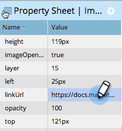

# 在自由格式登录页面中为图像添加链接 {#add-a-link-to-an-image-in-a-free-form-landing-page}

要使登陆页面上的图像成为可单击的链接，请执行以下步骤。

>[!PREREQUISITES]
>
>[将图像添加到自由格式登陆页面](/help/marketo/product-docs/demand-generation/landing-pages/free-form-landing-pages/add-an-image-to-a-free-form-landing-page.md)

1. 单击要向其添加链接的图像。

   

1. 展开&#x200B;**[!UICONTROL Property Sheet]**。

   

1. 将链接复制或键入到&#x200B;**[!UICONTROL linkUrl]**&#x200B;框中。

   

   您已成功添加指向登陆页面上图像的链接。 您现在可以[预览页面](/help/marketo/product-docs/demand-generation/landing-pages/landing-page-actions/preview-a-landing-page.md)以查看其实际操作情况。

>[!TIP]
>
>始终测试您的页面。
