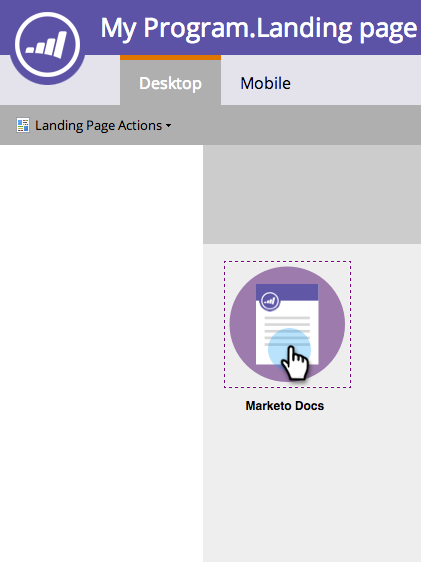

# 在自由格式登陆页{#add-a-link-to-an-image-in-a-free-form-landing-page}中添加指向图像的链接

想让登陆页上的图像成为指向其他页面／站点的链接吗？ 这是方法。

>[!PREREQUISITES]
>
>* [将图像添加到自由格式登陆页](add-an-image-to-a-free-form-landing-page.md)

>

1. 单击要添加链接的图像。

   

1. 展开&#x200B;**属性表**。

   

1. 将链接复制或键入到**linkUrl **框中。

   

   恭喜！ 您现在已成功地在登陆页上添加了指向图像的链接。 您现在可以[预览页面](../../../../product-docs/demand-generation/landing-pages/landing-page-actions/preview-a-landing-page.md)，以查看其实际操作情况。

>[!TIP]
>
>始终测试页面！

>[!NOTE]
>
>**相关文章**
>
>* [预览登陆页](../../../../product-docs/demand-generation/landing-pages/landing-page-actions/preview-a-landing-page.md)

>

