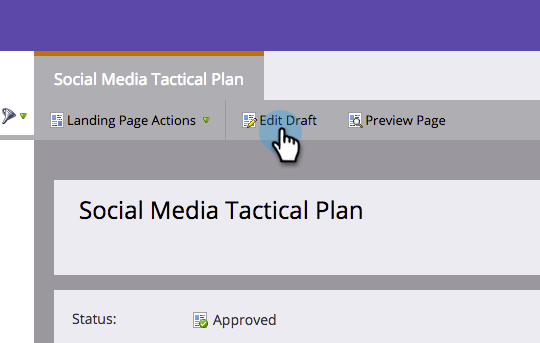

# 为您的自由表单登陆页面添加移动视图 {#add-a-mobile-view-for-your-free-form-landing-page}

在智能手机上，您可以轻松让自由格式的登陆页面看起来很棒。

>[!NOTE]
>
>移动设备视图适用于宽度为480px（或更小）的屏幕。 换言之，就是智能手机。 更多内容 [设备分辨率信息](https://www.mydevice.io/).

1. 转到 **营销活动**.

   

1. 选择一个自由格式登陆页面。

   

1. 单击 **编辑草稿**.

   

1. 单击 **移动设备** 选项卡。

   

1. 单击 **激活**.

   

   >[!CAUTION]
   >
   >可能需要升级自由格式模板。 如果您看到该消息，请快速阅读如何 [使现有的自由表单登陆页面模板移动设备兼容](/help/marketo/product-docs/demand-generation/landing-pages/landing-page-templates/make-an-existing-free-form-landing-page-template-mobile-compatible.md).

1. 太棒了！ 您现在已激活登陆页面的移动版本。 单击&#x200B;**关闭**。

   

   您现在可以 [自定义您的移动视图](/help/marketo/product-docs/demand-generation/landing-pages/free-form-landing-pages/customize-mobile-view-for-your-free-form-landing-page.md).

   
