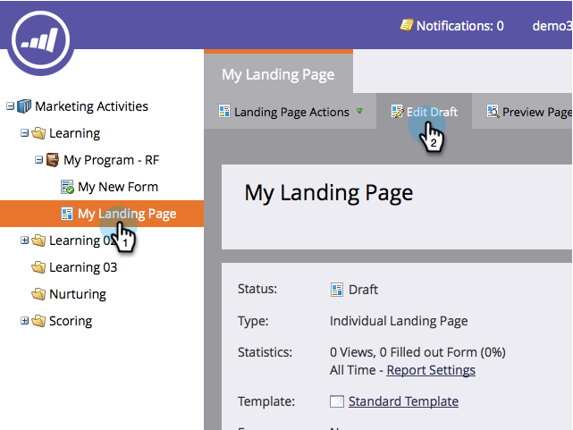

# 向自由格式登陆页面添加新表单 {#add-a-new-form-to-a-free-form-landing-page}

表单，满足登陆页面。 登陆页面，见面表单。

>[!PREREQUISITES]
>
>* [创建表单](/help/marketo/product-docs/demand-generation/forms/creating-a-form/create-a-form.md)
>* [创建自由格式登陆页面](/help/marketo/product-docs/demand-generation/landing-pages/free-form-landing-pages/create-a-free-form-landing-page.md)

1. 转到 **营销活动**.

   

1. 查找登陆页面并单击 **编辑草稿**.

   

1. 拖放 **表单** 元素。

   

1. 查找并选择要添加的表单。

   

1. 在选择后续页面时，有三个选项可供您选择：

   * **登陆页面**  — 选择Marketo登陆页面
   * **外部URL**  — 选择您想要的任何URL
   * **定义的表单**  — 使用在表单级别定义的设置

   >[!NOTE]
   >
   >**条件**
   >
   >后续页面是用户在提交表单后将看到的页面。

1. 单击 **插入**.

   

   干得好！

只需关闭登陆页面编辑器和 [批准登陆页面草稿](/help/marketo/product-docs/demand-generation/landing-pages/understanding-landing-pages/approve-unapprove-or-delete-a-landing-page.md).
