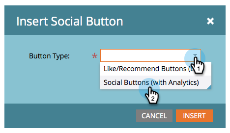

# 将社交按钮添加到自由形式登陆页{#add-a-social-button-to-a-free-form-landing-page}

社交按钮鼓励用户与其朋友共享您的内容。 将其放在自由形式登陆页、Facebook和您的网站上。

>[!AVAILABILITY]
>
>并非所有客户都购买了此功能。 有关详细信息，请与销售代表联系。

1. 导航到自由格式登陆页，然后单击“编辑草稿”**。**

   

1. 从右侧的元素拖过&#x200B;**社交按钮**。

   

1. 选择&#x200B;**社交按钮（带Analytics）**。

   

   登陆页激活后，请在[社交仪表板](/help/marketo/product-docs/demand-generation/social/social-functions/view-social-performance.md)上查看由社交按钮（使用Analytics）生成的活动。

   如果添加“赞／推荐按钮”(Lite)，请参阅[登陆页性能报告](/help/marketo/product-docs/demand-generation/landing-pages/understanding-landing-pages/landing-page-performance-report.md)中的共享数。

1. 从下拉菜单中选择&#x200B;**新建**。

   >[!NOTE]
   >
   >您还可以通过选择&#x200B;**新建** > **新建本地资产**&#x200B;在项目内创建社交按钮。

1. 命名社交按钮，从&#x200B;**克隆自**&#x200B;中选择&#x200B;**无**，然后单击&#x200B;**插入**。

   

   >[!TIP]
   >
   >要节省时间，您可以使用&#x200B;**克隆自**&#x200B;选项从现有社交按钮复制所有设置。

   [将登陆页发布](/help/marketo/product-docs/demand-generation/facebook/publish-landing-pages-to-facebook.md) [到Facebook将社交按钮放在您的网站上](/help/marketo/product-docs/demand-generation/social/social-functions/deploy-social-on-your-website.md)

恭喜！ 您已向登陆页添加社交按钮。 请务必批准登陆页。

>[!MORELIKETHIS]
>
>您已完成，但可以根据需要更改社交按钮的设置。 开始[自定义按钮样式](/help/marketo/product-docs/demand-generation/social/configuring-social-actions/customize-social-app-button.md)或[编辑显示的共享消息](/help/marketo/product-docs/demand-generation/social/configuring-social-actions/configure-social-sign-up-share-flow.md)。
