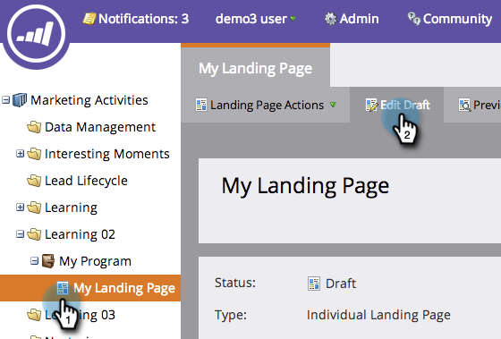
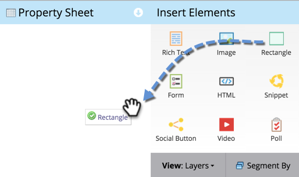

# 向自由格式登录页面添加矩形 {#adding-a-rectangle-to-a-free-form-landing-page}

登陆页面上的矩形可用于高亮显示内容部分或在视觉上分隔内容部分。

1. 选择一个自由格式登陆页面，然后单击&#x200B;**[!UICONTROL Edit Draft]**。

   

   >[!NOTE]
   >
   >此时将在新窗口中打开自由格式登陆页面设计器。

1. 拖动到&#x200B;**[!UICONTROL Rectangle]**&#x200B;元素上。

   

1. 选择您的矩形并使用&#x200B;**[!UICONTROL Property Sheet]**&#x200B;进行所需的任何更改。

   >[!TIP]
   >
   >您可以使用拖放来移动矩形并调整其大小。 同时尝试键盘上的箭头！ 提示：按Shift键箭头可一次移动矩形10像素。

   

现在，您可以在自由格式登陆页面中添加矩形。
