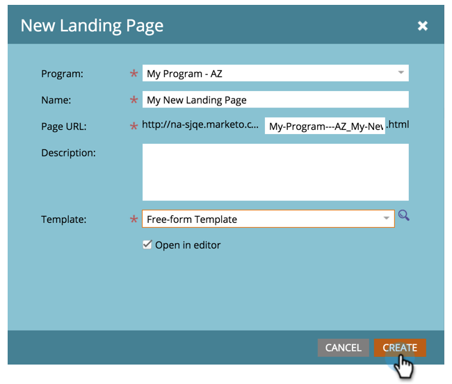

# 创建自由格式登陆页面 {#create-a-free-form-landing-page}

自由格式登陆页面可以创建为项目的本地资产，也可以在Design Studio中创建为供全局使用的资产。

>[!NOTE]
>
>登陆页面模式由其模板定义。 [了解更多](/help/marketo/product-docs/demand-generation/landing-pages/understanding-landing-pages/understanding-free-form-vs-guided-landing-pages.md) 关于自由格式和引导式登陆页面模板。

## 在项目中创建自由格式登陆页面 {#create-a-free-form-landing-page-in-a-program}

1. 转到 **营销活动**.

   

1. 单击您的程序。

   

1. 单击 **新建**. 选择 **新建本地资产**.

   

1. 单击 **登陆页面**.

   

1. 命名登陆页面，然后从下拉菜单中选择自由格式模板。

   >[!NOTE]
   >
   >没有图标的模板是自由格式的。 自由格式模板允许进行完全自定义。

   

1. 单击&#x200B;**创建**。

   

>[!TIP]
>
>URL是通过项目和登陆页面名称自动构建的。 要更改URL，请编辑 **页面URL** 字段。

## 在Design Studio中创建自由格式登陆页面 {#create-a-free-form-landing-page-in-design-studio}

1. 转到 **Design Studio**.

   

1. 单击 **新建**，则 **新建登陆页面**.

   

1. 命名登陆页面，然后从下拉菜单中选择自由格式模板。

   

1. 单击&#x200B;**创建**。

   

>[!TIP]
>
>如果不希望编辑器在单击后立即打开，请取消选中“为新页面打开登陆页面编辑器” **创建**.
