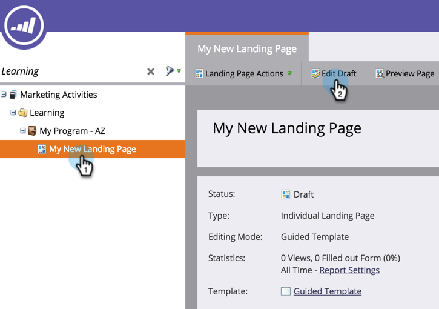

# 向引导式登录页面添加图像 {#add-an-image-to-a-guided-landing-page}

与自由格式登陆页面不同，引导式登陆页面在添加图像的位置具有预定义的锁定空间。

1. 选择引导式登陆页面。 单击 **[!UICONTROL Edit Draft]**。

   

1. 单击要编辑的图像。 元素占位符将在登陆页面画布中发光。

   

1. 选择所需的图像并单击&#x200B;**[!UICONTROL Insert]**。

   

1. 内容将显示在元素占位符中。

   >[!NOTE]
   >
   >图像大小的调整方式取决于模板。 了解有关[引导式登陆页面模板](/help/marketo/product-docs/demand-generation/landing-pages/landing-page-templates/create-a-guided-landing-page-template.md)的更多信息。

   

   >[!TIP]
   >
   >当前不支持在编辑器中指定图像的链接。 请改用富文本元素。
