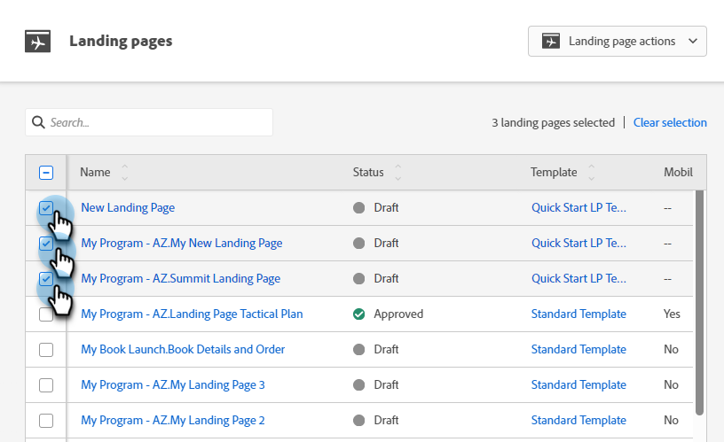

# 一次批准多个登录页面 {#approve-multiple-landing-pages-at-once}

1. 前往 **[!UICONTROL Design Studio]**。

   

1. 单击 **[!UICONTROL Landing Pages]**。

   

1. 选择所需的登陆页面。

   

   >[!TIP]
   >
   >请不要单击实际的登陆页面名称，这些是链接，会将您转到页面本身。

1. 选择登陆页面后，单击&#x200B;**登陆页面操作**&#x200B;下拉列表，然后选择&#x200B;**批准**。

   

1. 单击&#x200B;**批准**。

   

   >[!TIP]
   >
   >您还可以将以上步骤用于其他批量选项，例如取消批准或删除。
