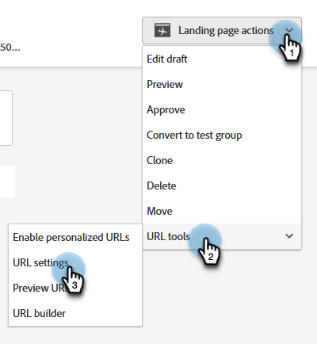
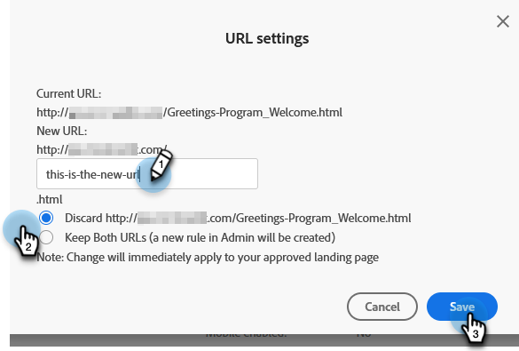

# 更改登录页面 URL {#change-the-landing-page-url}

您可以修改登陆页面的URL。 这有助于使URL更容易记住并改进SEO。

1. 查找并选择所需的登陆页面。

   

1. 单击&#x200B;**登陆页面操作**&#x200B;下拉列表，滚动到&#x200B;**URL工具**&#x200B;并选择&#x200B;**URL设置**。

   

1. 输入&#x200B;**[!UICONTROL New URL]**，选择丢弃或重新定向旧URL，然后单击&#x200B;**[!UICONTROL Save]**。

   

   >[!NOTE]
   >
   >如果您决定要保留这两个URL，则会自动创建重定向规则。 了解有关[URL重定向](/help/marketo/product-docs/demand-generation/landing-pages/personalizing-landing-pages/redirect-a-url-path.md)的更多信息。
