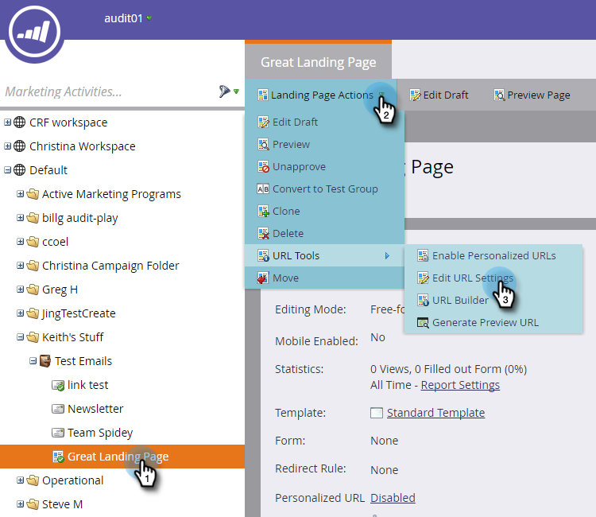

# 更改登陆页URL {#change-the-landing-page-url}

您可以修改登陆页的URL**。**这有助于使URL更易于记住，并改进SEO。

1. 选择登陆页。 单击 **登陆页** 操作下拉框，滚动到 **URL工具** ，然后选 **择编辑URL设置。**

   

1. 输入 **新URL**，选择放弃或重定向旧URL，然后单击“保 **存”。**

   

   >[!NOTE]
   >
   >如果您决定保留这两个URL，将自动创建重定向规则。 进一步了 [解URL重定向](http://docs.marketo.com/display/public/DOCS/Redirect+a+URL+Path)。

