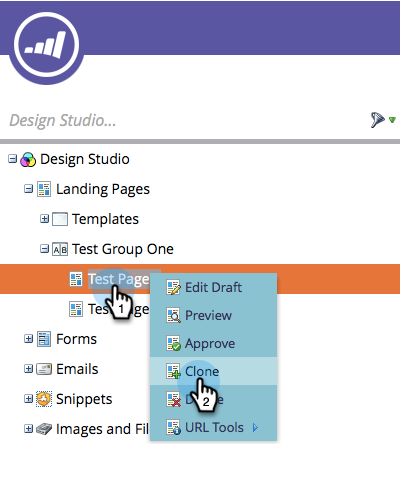

# 克隆登陆页面测试组 {#cloning-a-landing-page-test-group}

从[!UICONTROL Design Studio]中，您可以查找并复制登陆页面测试组。

1. 右键单击未批准的页面。 选择 **[!UICONTROL Clone]**。

   

1. 为此克隆页面提供一个新的&#x200B;**[!UICONTROL Name]**。 克隆的页面显示在当前文件夹的底部。

   

1. 现在，通过单击&#x200B;**[!UICONTROL New]**&#x200B;并选择&#x200B;**[!UICONTROL New Test Group]**&#x200B;来创建新的测试组。

   

1. 在创建新登陆页面对话框中，输入新测试组&#x200B;**[!UICONTROL Name]**。

   

1. 在对话框底部，选择&#x200B;**[!UICONTROL Available Landing Pages]**&#x200B;列表中的克隆页面，然后单击指向右侧的箭头以将其包含在&#x200B;**[!UICONTROL Tested Landing Pages]**&#x200B;中。 对此组中需要的所有登陆页面执行此操作。

   

1. 完成后，单击&#x200B;**[!UICONTROL Create]**。

   

1. 准备好启动测试组后，在树中右键单击该组并选择&#x200B;**[!UICONTROL Approve Test Group]**。

   

   该组现在将积极跟踪访问情况和表单完成情况，以便您能够查看哪个登陆页面的表现最佳。
