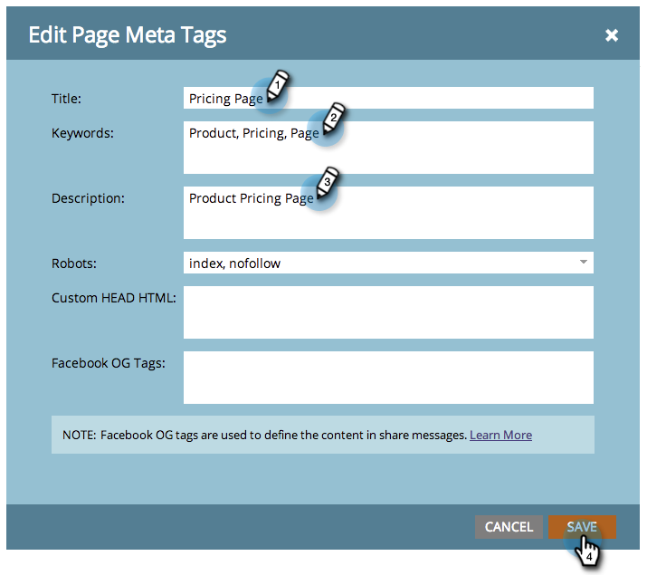

# 编辑登陆页标题和元数据{#edit-landing-page-title-and-metadata}

Marketo允许您编辑登陆页[meta标记以用于SEO](https://www.w3schools.com/tags/tag_meta.asp)，并自定义HTML的`<head>`部分。

1. 选择登陆页，然后单击“编辑草稿”**。**

   

   >[!NOTE]
   >
   >登陆页设计器将在新窗口中打开。

1. 在&#x200B;**登陆页操作**&#x200B;下，单击&#x200B;**编辑页面元标记**。

   

1. 输入页面的&#x200B;**标题**、**关键字**&#x200B;和&#x200B;**说明**。 选择所需的&#x200B;**Robots**&#x200B;选项，并输入您想要用于HTML `<head>`部分的任何自定义内容。 单击&#x200B;**保存**。

   

   >[!TIP]
   >
   >**罗博茨什  么意思？**
   >
   >**索引**:页面。**关注**:搜索引擎可以跟踪索引页面上的链接。

1. 随时编辑标记并批准登陆页。
