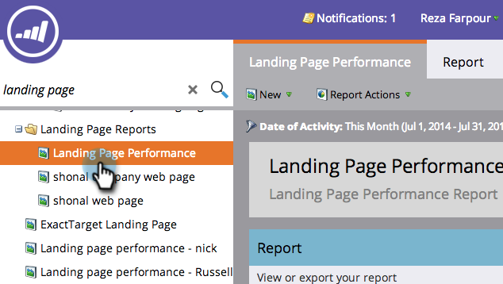

# 过滤登陆页面性能报表 {#filter-a-landing-page-performance-report}

集中您的 [登陆页面性能报告](/help/marketo/product-docs/demand-generation/landing-pages/understanding-landing-pages/landing-page-performance-report.md) 登录页面（本地资产）、Design Studio（全局资产）或已存档的页面。

1. 转到 **Analytics** (或 **营销活动**)。

   

1. 从导航树中选择您的登陆页面报表。

   

1. 单击 **设置** 选项卡，并在过滤器中拖动。

   

   * **Design Studio登录页面：** 全局资产，在Design Studio中管理。
   * **营销活动登陆页面：** “营销活动”选项卡上项目中的本地资产。
   * **存档的登陆页面：** 不活动且已停用的登陆页面。

1. 选择要包含在报表中的文件夹和特定登陆页面。

   

   >[!TIP]
   >
   >如果选择文件夹，则报表将包含运行报表时该文件夹包含的所有内容。

1. 你完了！ 单击 **报表** 选项卡来查看过滤的报表。

   
