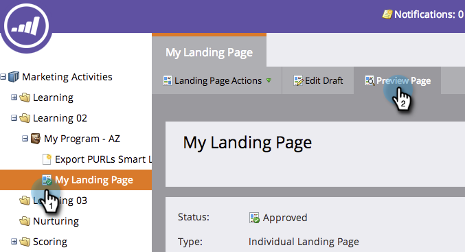

# 预览包含动态内容的登录页面 {#preview-a-landing-page-with-dynamic-content}

添加动态内容后预览登陆页面，确保一切看起来与预期的一样。

>[!PREREQUISITES]
>
>* [在登陆页面中使用动态内容](/help/marketo/product-docs/demand-generation/landing-pages/personalizing-landing-pages/use-dynamic-content-in-a-landing-page.md)
>* [预览登陆页面](/help/marketo/product-docs/demand-generation/landing-pages/landing-page-actions/preview-a-landing-page.md)

1. 选择登陆页面并单击&#x200B;**[!UICONTROL Preview Page]**。

   

1. 单击下拉菜单并选择&#x200B;**区段**&#x200B;进行预览。

   

现在，您可以确保登陆页面在区段间按您所需的方式工作。
