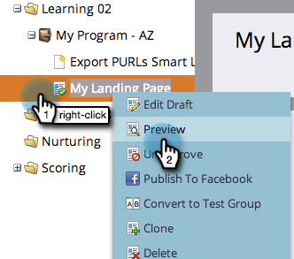

# 预览登陆页面 {#preview-a-landing-page}

在登陆页面上线之前，您可能想要查看其外观。

## 预览登陆页面 {#preview-a-landing-page-1}

1. 选择登陆页面并单击 **预览页面**.

   

   >[!NOTE]
   >
   >草稿是您正在处理的版本，而不是客户看到的实时版本。

1. 您还可以右键单击您的登陆页面并选择 **预览**.

   

## 预览登陆页面草稿 {#preview-a-landing-page-draft}

1. 右键单击包含草稿版本的已批准登陆页面，然后单击 **预览草稿**.

   

## 编辑时预览登陆页面草稿 {#preview-a-landing-page-draft-while-editing}

1. 选择登陆页面并单击 **编辑草稿**.

   

1. 在登陆页面编辑器中工作期间，您可以随时单击 **预览草稿**.

   

1. 通过单击 **编辑草稿**.

   

干得好！ 现在，您已了解如何预览登陆页面。
