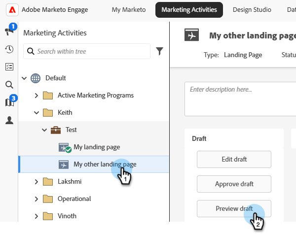

# 预览登录页面 {#preview-a-landing-page}

预览登陆页面，查看登陆页面在上线之前的样式。

>[!IMPORTANT]
>
>某些自定义元标记在预览模式下不受支持（例如`<meta http-equiv="refresh" ...>`重定向指令），因为它们可能会违反为确保Marketo Engage安全而制定的内容安全策略。 通过生成预览URL（**预览操作** > **生成预览URL**）并将其粘贴到新的浏览器窗口，可以预览带有这些标记的登陆页面。

## 预览已批准的页面 {#preview-approved-page}

1. 选择所需的登陆页面，然后单击&#x200B;**[!UICONTROL Preview]**。

   

您还可以右键单击登陆页面并选择&#x200B;**[!UICONTROL Preview]**。

## 预览草稿 {#preview-a-draft}

1. 选择所需的登陆页面，然后单击&#x200B;**[!UICONTROL Preview draft]**。

   

>[!NOTE]
>
>草稿是您正在处理的版本，而不是客户看到的实时版本。

## 编辑时预览登陆页面草稿 {#preview-a-draft-while-editing}

1. 选择所需的登陆页面，然后单击&#x200B;**[!UICONTROL Edit draft]**。

   

1. 在登陆页面编辑器中，单击&#x200B;**[!UICONTROL Preview draft]**。

   

1. 单击&#x200B;**[!UICONTROL Edit draft]**&#x200B;以返回编辑状态。

   
