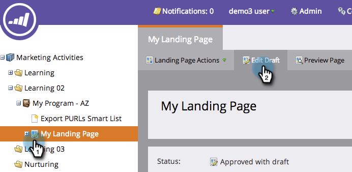

# 预览登录页面 {#preview-a-landing-page}

预览登陆页面，查看登陆页面在上线之前的样式。

## 预览登录页面 {#preview-a-landing-page-1}

1. 选择登陆页面并单击&#x200B;**[!UICONTROL Preview Page]**。

   

   >[!NOTE]
   >
   >草稿是您正在处理的版本，而不是客户看到的实时版本。

1. 您还可以右键单击登陆页面并选择&#x200B;**[!UICONTROL Preview]**。

   

## 预览登陆页面草稿 {#preview-a-landing-page-draft}

1. 右键单击具有草稿版本的已批准登陆页面，然后单击&#x200B;**[!UICONTROL Preview Draft]**。

   

## 编辑时预览登陆页面草稿 {#preview-a-landing-page-draft-while-editing}

1. 选择登陆页面并单击&#x200B;**[!UICONTROL Edit Draft]**。

   

1. 在登陆页面编辑器中工作时，您可以随时单击&#x200B;**[!UICONTROL Preview Draft]**。

   

1. 您可以通过单击&#x200B;**[!UICONTROL Edit Draft]**&#x200B;快速返回编辑状态。

   

您现在知道如何预览登陆页面。
