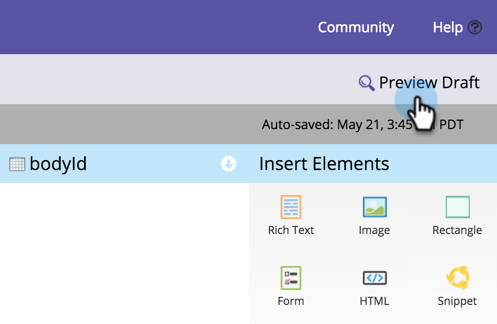

# 预览登陆页{#preview-a-landing-page}

您可能希望在登陆页生效之前先查看其外观。

## 预览登陆页{#preview-a-landing-page-1}

1. 选择登陆页并单击&#x200B;**预览** **页面**。

   

   >[!NOTE]
   >
   >草稿是您正在处理的版本，而不是客户看到的实时版本。

1. 您还可以右键单击登陆页并选择&#x200B;**预览**。

   

## 预览登陆页草稿{#preview-a-landing-page-draft}

1. 右键单击具有草稿版本的已批准登陆页，然后单击&#x200B;**预览** **草稿**。

   

## 在编辑{#preview-a-landing-page-draft-while-editing}时预览登陆页草稿

1. 选择登陆页，然后单击&#x200B;**编辑** **草稿**。

   

1. 在登陆页编辑器中工作期间，您可以随时单击“预览草稿”。****

   

1. 单击&#x200B;**编辑草稿可快速返回编辑。**

   

干得好！ 现在您知道如何预览登陆页。
