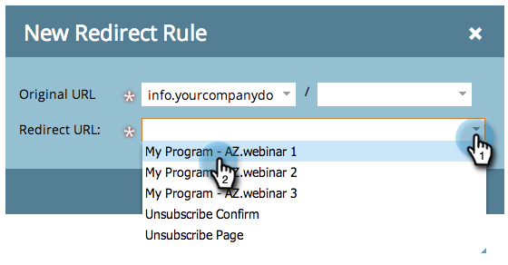

# 将Marketo登陆页面重定向到其他页面 {#redirect-a-marketo-landing-page-to-another-page}

如果您更新了页面的URL并希望旧URL仍然有效，请尝试重定向！ 设置起来很容易。

>[!NOTE]
>
>**需要管理员权限**

1. 在 **管理员**，单击 **登陆页面**.

   

1. 在 **规则** ，单击 **新建** 然后 **新的重定向规则**.

   

1. 单击第一个 **原始URL** 下拉并选择您的Marketo [CNAME](/help/marketo/product-docs/demand-generation/landing-pages/landing-page-actions/customize-your-landing-page-urls-with-a-cname.md).

   

   >[!NOTE]
   >
   >请记住，您只能重定向以Marketo开头的URL [CNAME](/help/marketo/product-docs/demand-generation/landing-pages/landing-page-actions/customize-your-landing-page-urls-with-a-cname.md).

1. 选择要在第二次重定向的登陆页面 **原始URL** 字段。

   

   >[!NOTE]
   >
   >即使页面或目录不存在，您也可以输入任何URL路径。

1. 单击 **重定向URL** 下拉菜单，然后选择要将访客重定向到的页面。

   

1. 单击&#x200B;**创建**。

   

   >[!TIP]
   >
   >要重定向到Marketo以外的网页，请单击 **使用非Marketo登陆页面**.

   >[!MORELIKETHIS]
   >
   >[重定向URL路径](/help/marketo/product-docs/demand-generation/landing-pages/personalizing-landing-pages/redirect-a-url-path.md)
