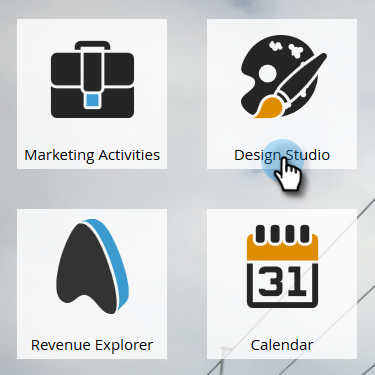

# 创建自由格式登录页面模板 {#create-a-free-form-landing-page-template}

与引导式登陆页面相比，自由格式登陆页面所需的技术知识更少。 要为将来的登陆页面创建模板，请执行以下步骤。

1. 前往 **[!UICONTROL Design Studio]**。

   

1. 单击&#x200B;**[!UICONTROL New]**，然后选择&#x200B;**[!UICONTROL New Landing Page Template]**。

   

1. 选择您的文件夹，然后为您的模板提供一个名称。 自由格式是默认的编辑模式，因此在命名模板后，请单击&#x200B;**[!UICONTROL Create]**。

   

1. 您的模板应在新选项卡中打开。 熟悉CSS/HTML的任何用户现在都可以编辑它。

   

   >[!NOTE]
   >
   >未设置Marketo支持以帮助对自定义HTML进行故障诊断。 如需HTML帮助，请咨询Web开发人员。

1. 完成编辑后，单击&#x200B;**[!UICONTROL Template Actions]**，然后选择&#x200B;**[!UICONTROL Approve and Close]**。

   

   >[!NOTE]
   >
   >如果要阻止表单预填充，或者只是不想跟踪特定页面上的Web行为，请选择&#x200B;**[!UICONTROL Disable Munchkin Tracking]**。
   >选择&#x200B;**[!UICONTROL Validate Mobile Compatibility]**&#x200B;以确保您的代码与移动设备兼容。

   >[!MORELIKETHIS]
   >
   >* [创建自由格式登陆页面](/help/marketo/product-docs/demand-generation/landing-pages/free-form-landing-pages/create-a-free-form-landing-page.md)
   >* [创建引导式登陆页面模板](/help/marketo/product-docs/demand-generation/landing-pages/landing-page-templates/create-a-guided-landing-page-template.md)
   >* [了解自由表单与引导式登陆页面](/help/marketo/product-docs/demand-generation/landing-pages/understanding-landing-pages/understanding-free-form-vs-guided-landing-pages.md)
