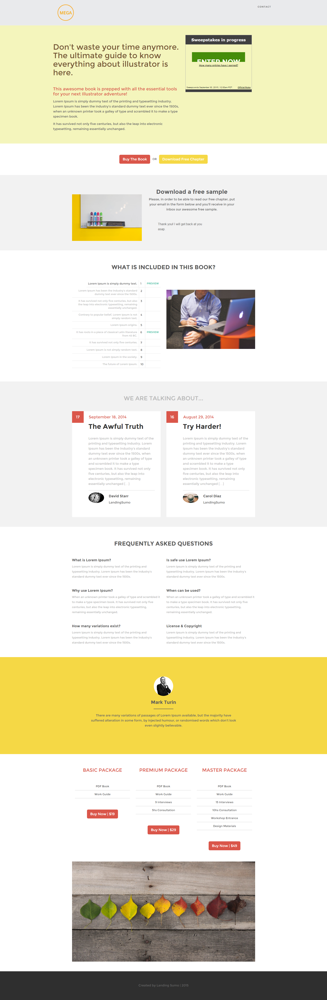

# 模板12E {#template-12e}

[下载模板12E](https://experienceleague.adobe.com/landing/marketo/lp-templates/template-12e.html)

此模板包含以下内容：

* 标题（可选）
* 主要部分

   * 包括主页标题、主页文本和抽奖

* 六个正文部分（可选）
* 页脚（可选）

**单击下面的可下载此模板：**

[模板12E.html](https://experienceleague.adobe.com/landing/marketo/lp-templates/template-12e.html)
